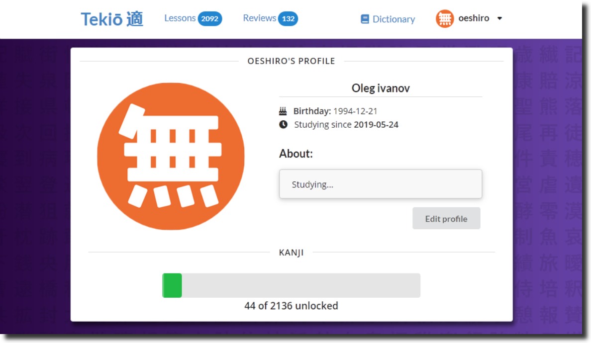
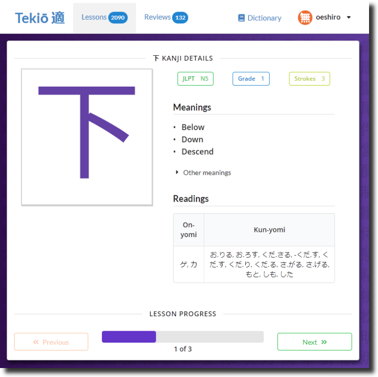
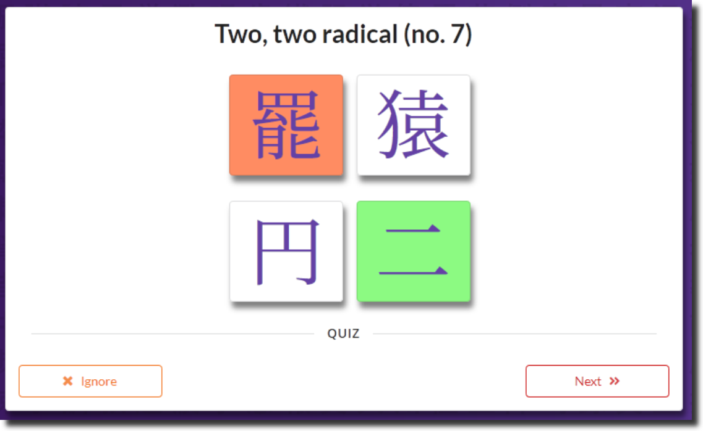
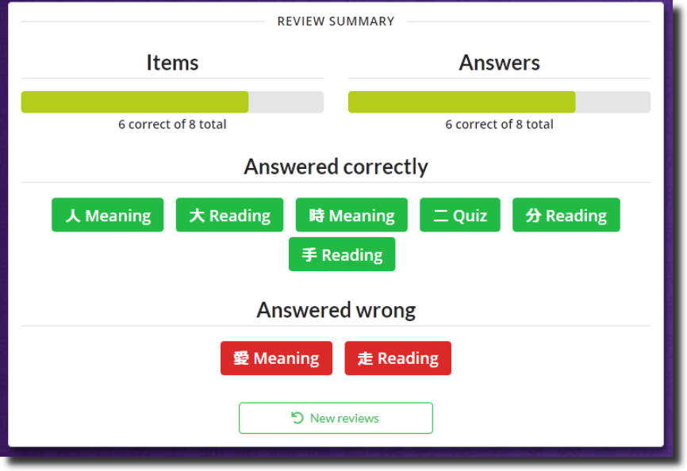

# Tekio

An application for learning Japanese kanji with SRS and personal recommendations.

## Disclamer

The app was written as a university final project in 2019. It might serve as an example of a middle-sized project made with functional programming (in Scala + http4s) and tagless final on the backend, es6 + React + Redux on the frontend, however I don't update or maintain it.

## Screenshots

 

 

 
